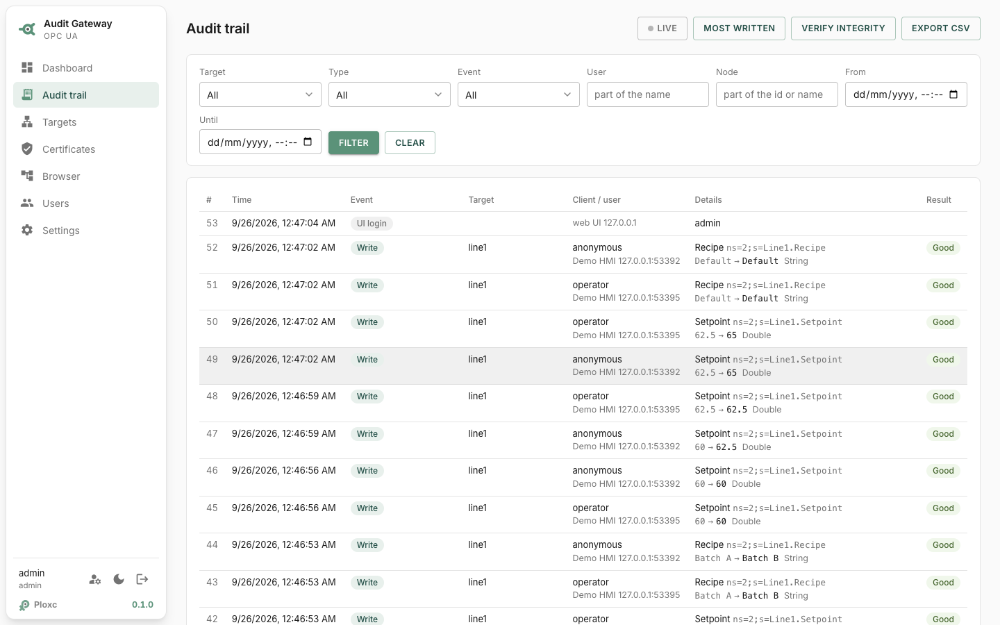
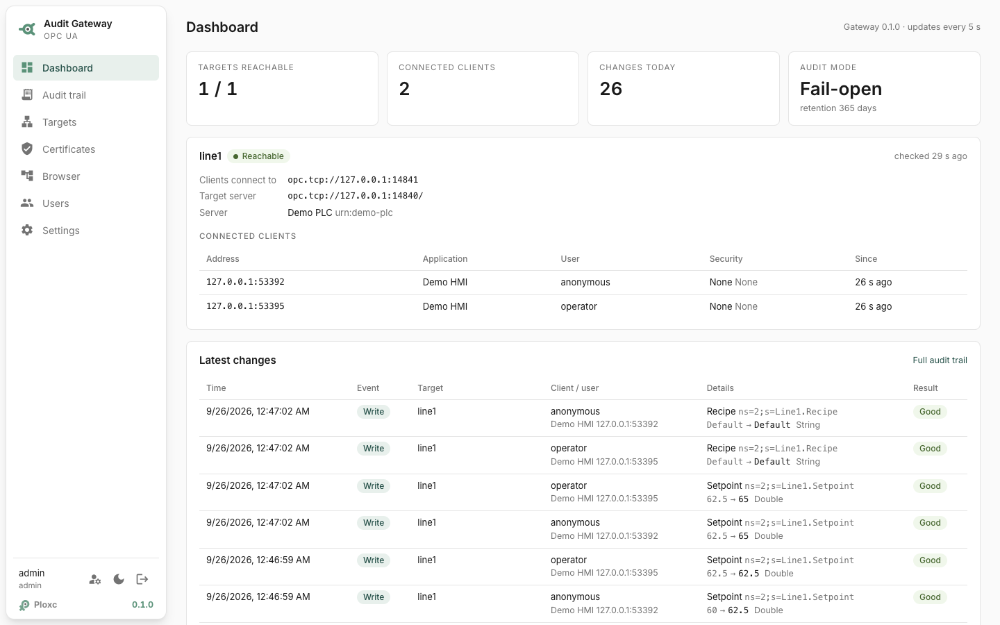
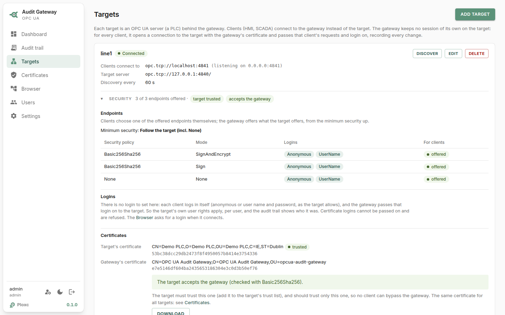
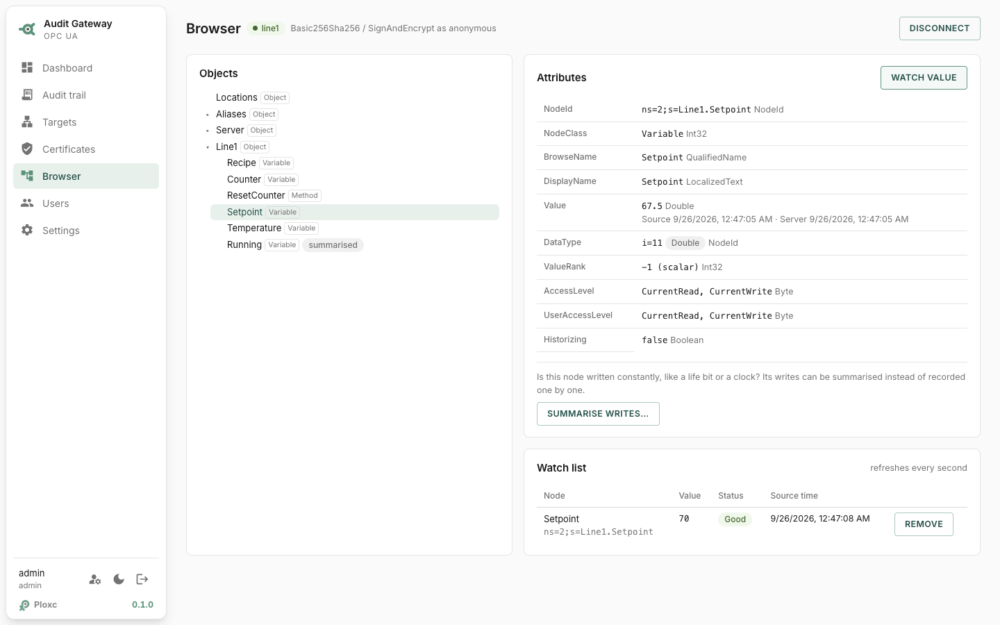

# OPC UA Audit Gateway

A transparent OPC UA gateway that records **who writes what, when**.

Put it between your OPC UA clients and your PLC. Clients connect to the gateway
instead of the PLC; the gateway forwards everything and keeps a tamper-evident
audit trail of every write, method call and client session. It is a single Rust
binary that runs standalone (Linux, Windows, macOS, ARM PLCs such as PLCnext) or
in Docker.

> **Status: a working concept, not production ready.** The code was written
> with Claude (Anthropic), from my idea and OPC UA/PLC domain knowledge, and
> tested as described in [What is tested](#what-is-tested). If there is
> interest, I'm open to developing it further.

What it does today:

- **Relay:** works for security `None`, `Sign` and `SignAndEncrypt` (all RSA
  policies), anonymous and user name logins, and every service (reads, writes,
  subscriptions, method calls, …).
- **Audit trail:** writes, method calls, history updates, node management,
  sessions and connections are recorded, with old value → new value and the
  node's display name, in a hash chain that shows any tampering.
- **Web UI:** status, the audit trail, targets, certificates, an OPC UA
  browser, users and settings.
- **Export:** audit records to QuestDB.
- **AI assistants:** an MCP endpoint, so Claude can search the trail or help
  configure the gateway, with per-token permissions.
- **Installation:** Docker, a systemd or Windows service, or a plain binary,
  with HTTPS.

**[Manual](docs/manual/README.md)** for installation, setup and use;
[ARCHITECTURE.md](ARCHITECTURE.md) for the design.

## Screenshots

The audit trail: every write with who, from which client, old → new value and
the result.

<picture>
  <source media="(prefers-color-scheme: dark)" srcset="docs/screenshots/audit-trail-dark.png">
  
</picture>

<details>
<summary>Dashboard, targets and the OPC UA browser</summary>

<picture>
  <source media="(prefers-color-scheme: dark)" srcset="docs/screenshots/dashboard-dark.png">
  
</picture>

<picture>
  <source media="(prefers-color-scheme: dark)" srcset="docs/screenshots/targets-dark.png">
  
</picture>

<picture>
  <source media="(prefers-color-scheme: dark)" srcset="docs/screenshots/browser-dark.png">
  
</picture>

</details>

## What is tested

Tested:

- About 100 automated tests: relay, audit store and hash chain, export, web API,
  certificates and the MCP endpoint. The end-to-end tests run a real OPC UA
  client and server through the gateway.
- The web UI, in a browser (Chromium), page by page.
- By hand against [OPC PLC](docker/opc-plc/) (Microsoft's simulator, in
  Docker) with the Prosys OPC UA Browser as client:
  - encrypted connections up to `Aes256-Sha256-RsaPss`;
  - certificate trust in both directions;
  - user name logins and writes.
- Against Siemens PLCSIM Advanced.
- The Docker image and `docker-compose.yml`, against OPC PLC: first start and
  first login, HTTPS on and off (`OPCUA_GATEWAY_WEB_TLS`), the web UI's own
  certificate, and a stable identity when the container is recreated.
- The MCP endpoint from Claude Desktop (through `mcp-remote`, over HTTPS) and
  Claude chat: reading the trail and changing the configuration.
- The release workflow as a dry run: every binary and the multi-arch image
  build; publishing a release has not run yet.

Not tested yet (the code and files are there, but nobody has run them for
real):

- The Linux service installation (systemd, `packaging/linux`) and the Windows
  service.
- Publishing a release (GitHub release, images on ghcr.io).
- Export to a real QuestDB (tested against a stand-in only).
- Real PLCs on a real network, over longer periods and under load.

## Quick start (Docker)

```sh
curl -LO https://raw.githubusercontent.com/ploxc/opcua-audit-trail/main/docker-compose.yml
docker compose up -d
docker compose logs gateway        # the first admin password
```

Open **https://127.0.0.1:8080** (a self-signed certificate: accept it once),
log in as `admin` with the password from the logs, choose your own, and add
a target on the **Targets** page. Clients then connect to the gateway
(`opc.tcp://<gateway>:4841`) instead of the PLC.

- Other ways to install: [Linux](docs/manual/installation/linux.md) ·
  [Windows](docs/manual/installation/windows.md) ·
  [macOS](docs/manual/installation/macos.md) ·
  [from source](docs/manual/installation/from-source.md)
- No PLC at hand? [Try it without a PLC](docs/manual/try-without-a-plc.md).
- Next: [trust between PLC and gateway](docs/manual/certificates.md),
  [HTTPS](docs/manual/https.md),
  [AI assistants](docs/manual/ai-assistants.md), and the rest of the
  [manual](docs/manual/README.md).

## License

MIT
